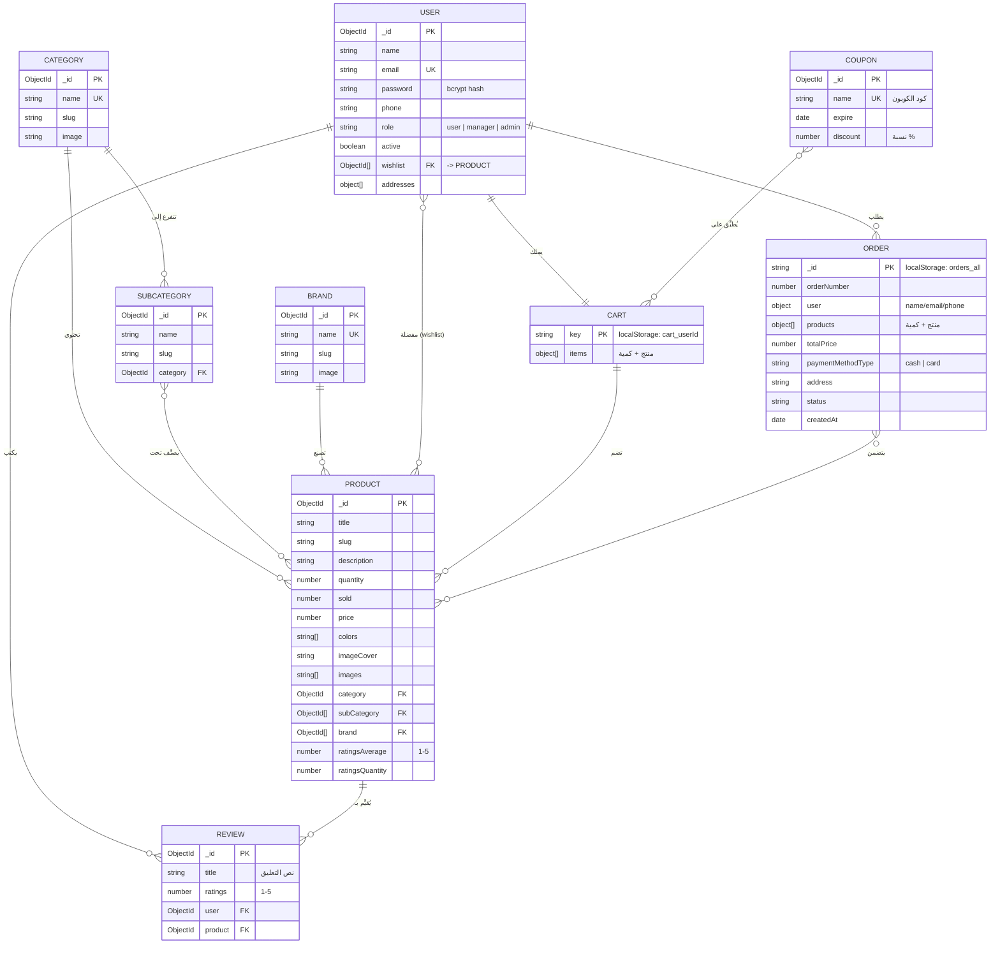

# تقرير المشروع العام — متجر إلكتروني (HappyShop)

> مرجع شامل لكتابة نوطة/توثيق المشروع، مع مخطط الكيانات والعلاقات (ERD).

---

## 1. فكرة المشروع

منصة تجارة إلكترونية عربية (RTL) متكاملة: عرض منتجات مصنفة حسب الفئات والماركات، بحث وفلترة وترتيب، تقييمات وتعليقات، سلة تسوق مع كوبونات خصم، إتمام طلبات، ولوحة تحكم إدارية كاملة — مع نظام صلاحيات ثلاثي الرتب.

## 2. التقنيات المستخدمة (Tech Stack)

| الطبقة | التقنية |
|---|---|
| الواجهة الأمامية | React 17 (Create React App)، React Router v6، React-Bootstrap 5 |
| إدارة الحالة | Redux + Redux Thunk (actions/reducers) + Custom Hooks لكل ميزة |
| الاتصال بالخادم | Axios (instance موحّد في `src/Api/baseURL.js`) |
| الإشعارات | React-Toastify |
| الباك إند (منشور) | Node.js + Express + MongoDB (Mongoose) — REST API v1 على Railway |
| المصادقة | JWT (Bearer Token) مخزن في localStorage |

## 3. نظام الصلاحيات (Roles)

| الرتبة | الصلاحيات |
|---|---|
| **زائر** (غير مسجل) | تصفح المنتجات والتصنيفات والماركات والبحث فقط — تفاصيل المنتج تتطلب تسجيل دخول |
| **user** (مستخدم عادي) | كل ما سبق + تفاصيل المنتج، التعليقات والتقييم، السلة وتطبيق الكوبونات، إتمام الشراء، طلباتي، الملف الشخصي |
| **manager** (مدير) | لوحة التحكم: إدارة الطلبات والمنتجات، إضافة ماركة/تصنيف/تصنيف فرعي/منتج/كوبون — **بدون** سلة أو تعليقات |
| **admin** (أدمن) | كل صلاحيات المدير + إدارة المستخدمين والمديرين |

الحماية عبر مكوّن `ProtectedRoute` (يفحص التوكن والرتبة ويعيد التوجيه)، وأي حساب جديد من واجهة التسجيل يحصل على رتبة **user** حصراً.

## 4. الوظائف الرئيسية

- **المصادقة**: تسجيل حساب (تحقق من بريد + هاتف سوري 09/+963 + كلمة سر ≥6)، دخول، نسيت كلمة السر (كود تحقق بالبريد)، خروج.
- **الكتالوج**: صفحة رئيسية (سلايدر، تصنيفات، الأكثر مبيعاً، ماركات)، صفحة متجر بفلاتر مشتركة (بحث جزئي LIKE + فئة + ماركة + نطاق سعر + ترتيب حسب المبيعات/التقييم/السعر).
- **المنتج**: معرض صور، مواصفات، تقييم بالنجوم مع تعليق (إضافة/تعديل/حذف لصاحب التعليق)، منتجات مشابهة من نفس التصنيف.
- **السلة والشراء**: إضافة للسلة، تعديل كمية، حذف، عرض الكوبونات الفعالة، تطبيق كوبون بنسبة خصم على الإجمالي، اختيار طريقة دفع، إنشاء طلب برقم متسلسل.
- **الطلبات**: "طلباتي" للمستخدم، و"إدارة الطلبات" + تفاصيل الطلب (منتجات + بيانات العميل) للإدارة.
- **الإدارة**: CRUD منتجات (مع رفع صور)، تصنيفات، تصنيفات فرعية، ماركات، كوبونات (اسم/نسبة/تاريخ انتهاء + حالة فعال/منتهي)، إدارة مستخدمين (للأدمن فقط).

## 5. مخطط الكيانات والعلاقات (ERD)



### ملاحظات على العلاقات
- **User–Review–Product**: علاقة M:N مفكوكة عبر كيان Review، بقيد: تعليق واحد لكل مستخدم على كل منتج، ومتوسط التقييم يُحدَّث تلقائياً في المنتج.
- **Product–Category**: N:1 (تصنيف رئيسي واحد)، و**Product–SubCategory** و**Product–Brand** مخزنة كمصفوفات مراجع.
- **Cart و Order**: حالياً كيانات محلية (localStorage) لعدم توفر مساراتها في الباك إند المنشور — بنيتها مطابقة لما يلزم لنقلها لاحقاً إلى MongoDB (انظر تقرير الباك إند).
- **Coupon**: عام على إجمالي السلة (غير مرتبط بمنتج أو تصنيف)، وفعاليته تُحسب من تاريخ `expire`.

## 6. بنية مجلدات الواجهة

```
src/
├── Api/baseURL.js          # نقطة الاتصال الموحدة بالـ API
├── Components/             # مكونات العرض (Admin, Cart, Category, Brand, Products, Rate, User, Uitily)
├── Page/                   # الصفحات (Home, Auth, Products, Cart, Checkout, Admin, User, ...)
├── hook/                   # منطق كل ميزة (auth, products, review, search, cart, category, brand...)
├── hooks/                  # دوال الاتصال العامة (useGetData, useInsertData, useUpdateData, useDeleteData)
├── redux/                  # actions + reducers + types
└── utils/                  # أدوات: fixImageUrl، currentUser (الرتب)، ordersStore (الطلبات)
```

## 7. حسابات التجربة

| الرتبة | البريد | كلمة المرور |
|---|---|---|
| admin | alaa2test123@gmail.com | user1234 |
| user | claudetestuser99@gmail.com | user1234 |

## 8. نقاط قوة تُذكر في النوطة

- فصل واضح للمسؤوليات: مكونات عرض ↔ hooks منطق ↔ redux حالة ↔ طبقة API.
- نظام صلاحيات كامل بثلاث رتب مطبق على مستوى المسارات والمكونات معاً.
- معالجة أخطاء دفاعية: روابط صور مكسورة تُصلح ديناميكياً مع صور احتياطية، ورسائل واضحة لكل حالة (عدم تسجيل، سلة فارغة، كوبون منتهٍ...).
- فلترة مركّبة (بحث + فئة + ماركة + سعر + ترتيب) تعمل معاً دون تعارض.
- دعم كامل للعربية RTL مع رسائل وإشعارات عربية.
